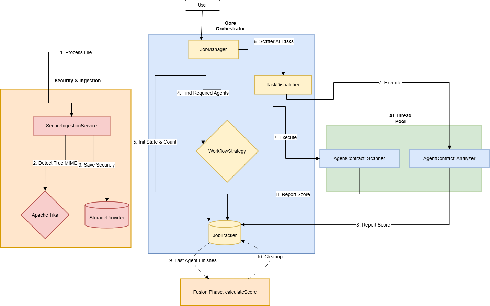

<div align="center">
  <h1>🛡️ AegisPipeline Core Engine</h1>
  <p><b>A lightweight, secure, event-driven Java orchestrator for asynchronous AI agents.</b></p>
  
  
  
  
  <p>------------------------------------------------------------------------------------</p>
</div>

**Status:** Milestone 1 (Core Orchestration Engine Complete)

A lightweight, event-driven Java library designed to orchestrate asynchronous AI tasks using the **Scatter-Gather** architectural pattern. It securely ingests files, dynamically routes them to specific machine learning agents based on magic-byte validation, and mathematically fuses their results.

## Milestone 1 Features
* **Secure Airlock (Apache Tika):** Inspects raw file streams for magic bytes to prevent malware spoofing (e.g., rejecting an `.exe` disguised as an `.mp4`) and strips original filenames to prevent path traversal attacks.
* **Strategy Pattern Routing:** Dynamically assigns AI workers to a payload based on the detected MIME type, ensuring zero hardcoding of AI logic inside the orchestrator.
* **Asynchronous Scatter-Gather:** Utilizes Java `CompletableFuture` and an `ExecutorService` thread pool to dispatch multiple AI tasks simultaneously without blocking the main API thread.
* **Thread-Safe Scoreboard:** Uses `ConcurrentHashMap` and `AtomicInteger` to track background job completion safely across multiple threads.

## Basic Usage 
````
// Initialize the orchestrator and map a specific file type to an AI agent strategy
AegisOrchestrator orchestrator = new AegisOrchestrator();
orchestrator.registerAgent("application/pdf", new PdfSummaryAgent());

// Process the file asynchronously across the thread pool without blocking the main API thread
CompletableFuture<Result> future = orchestrator.process(secureFileStream);

// Retrieve and print the final fused probability score once all assigned workers complete their tasks
future.thenAccept(result -> System.out.println("AI Confidence Score: " + result.getScore()));

````

## Architecture Flow
1. **Gateway:** Receives `MultipartFile`.
2. **Security:** Validates magic bytes and streams to abstracted `StorageProvider`.
3. **Lookup:** Matches the secure file type to a `WorkflowStrategy`.
4. **Scatter:** Dispatches the payload to the required `AgentContract` workers asynchronously.
5. **Gather:** Awaits all thread callbacks and fuses the final probability score.



## 🛠️ Testing
The core engine is fully unit-tested using JUnit and Mock agents to verify asynchronous routing and thread safety without requiring heavy ML models to be loaded locally.
